# God bless All

## PPT3

## Threads, SMP and Microkernels

### Processes and Threads

- Processes have two characteristics

  - Resource ownership
    - Process includes a virtual address space to hold the process image
  - Scheduling/execution
    - Follows an execution path that may be interleaved with other processes.

- These two characteristics are treated independently by the operating system

- The dispatching unit is referred to as a thread or lightweight process.
- The entity that owns a resource is referred to as a process or a task.
- One process / task can have one or more threads.

### Multithreading

- The ability of an OS to support multiple concurrent paths of execution within a single process.
  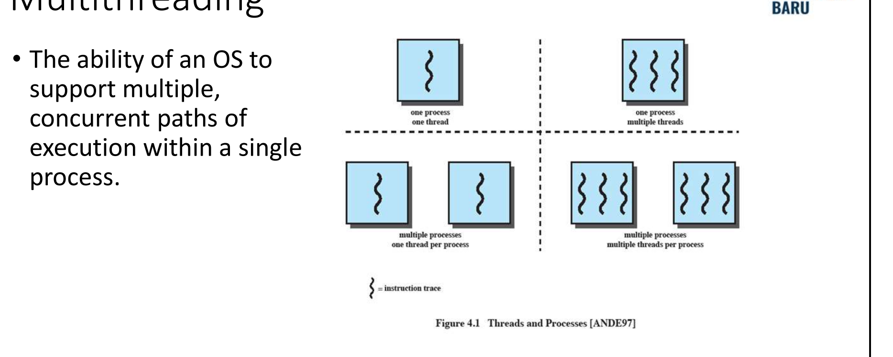
- Java Run Time Environment is a single process with multiple threads.
- Multiple process and threads are found in Windows, Solaris and many modern versions of UNIX.

#### Single Thread Approaches

- MS-DOS supports a single user process and a single thread.
- Some UNIX, support multiple user processes but only support one thread per process

### Processes

- A virtual space which holds the process images
- Protected access to
  - Processors
  - Other processes
  - Files
  - I/O resources

### One or More Threads in Process

- Each thread has - An execution state (running, ready, etc.) - Saved thread context when not running
  - An execution stack
  - Some per-thread static storage for local variables
  - Access to the memory and resources of its process (all threads of a process
    share this)

> One way to view a thread is as an independent program counter operating _within_ a process

### Threads vs processes

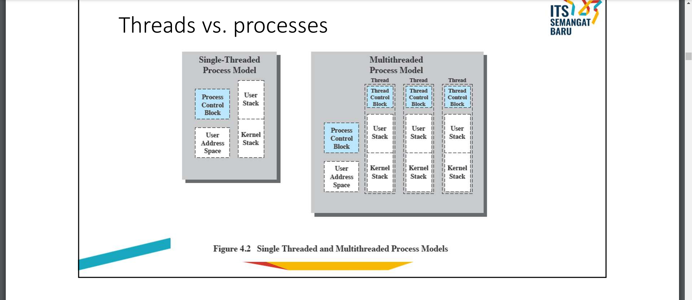

### Benefits of Threads

- Takes less time to create a new thread than a process
- Less time to terminate a thread than a process
- Switching between two threads takes less times than switching processes
- Threads can communicate with each other
  - Without invoking the kernel

### Thread use in a Single-User system

- Foreground and background work
- Asynchronous processing
- Speed of execution
- Modular program structure

### Threads

- Several actions that affect all of the threads in a process
  - The OS must manage these at the process level.
- Examples:
  - Suspending a process involves suspending all threads of the process
  - Termination of a process, terminates all threads within the process

### Activites similar to processes

- Threads have execution states and may synchronize with one another.

  - Similar to processes

- We look at these two aspects of thread functionality in turn.
  - States
  - Synchronisation

### Thread Execution States

- States associated with a change in thread state
  - Spawn (another thread)
  - Block
    - Issue: will blocking a thread block other, or all threads
  - Unblock
  - Finish (thread)
    - Deallocate register context and stacks

### Example: Remote Procedure Call

- Consider:
  - A program that performs two remote procedure calls (RPCs)
  - to two different hosts
  - to obtain a combined result.
    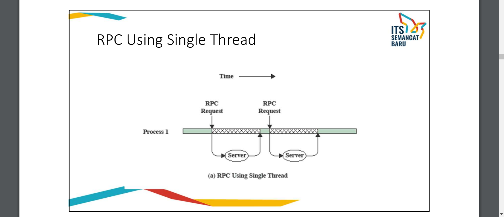
    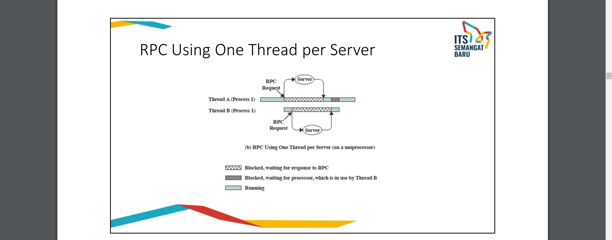
    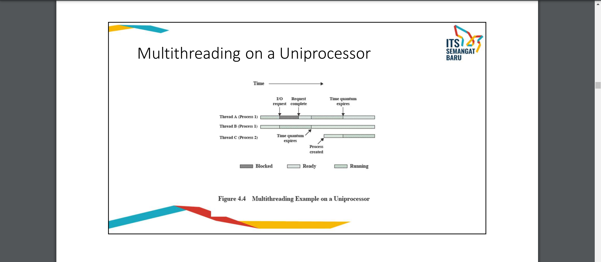

### Categories of Thread Implementation

- User Level Thread (ULT)
  - thread that are managed entirely by user-level code
  - Not requiring any support from the operating system kernel.
- Kernel level Thread (KLT) also called:
  - kernel-supported threads
  - lightweight processes.

### User level threads

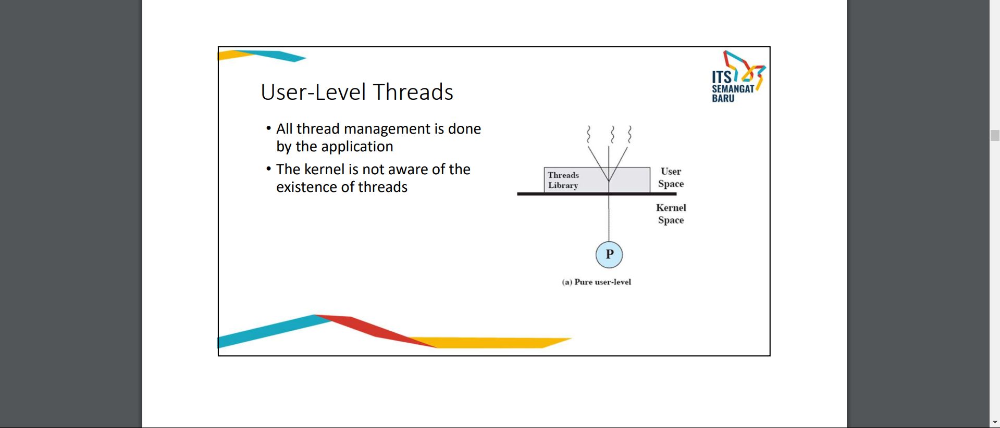

### Kernel-level threads

- Kernel maintains context information for the process and the threads
  - No thread management done by application
- Scheduling is done on a thread basis
- Windows is an example of this approach

### Advantages of KLT

- The kernel can simultaneously schedule multiple threads from the same process on multiple processors.
- If one thread in a process is blocked, the kernel can shedule another thread of the same process.
- Kernel routines themselves can be multithreaded

### Disadvantages of KLT

- The transfer of control from one thread to another within the same process require a mode switch to the kernel.

### Comparison ULT and KLT

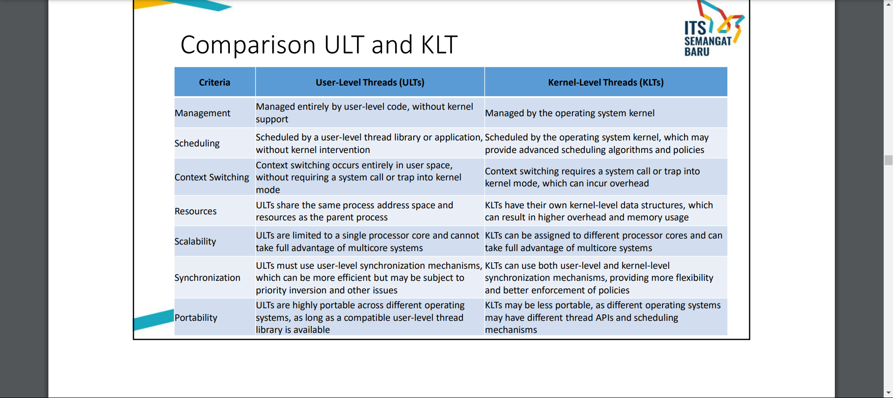

### Combined Approaches

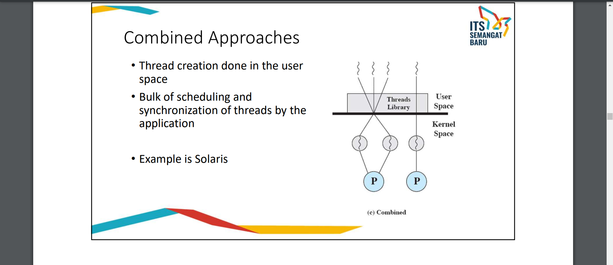

### Relationship between Thread and Processes

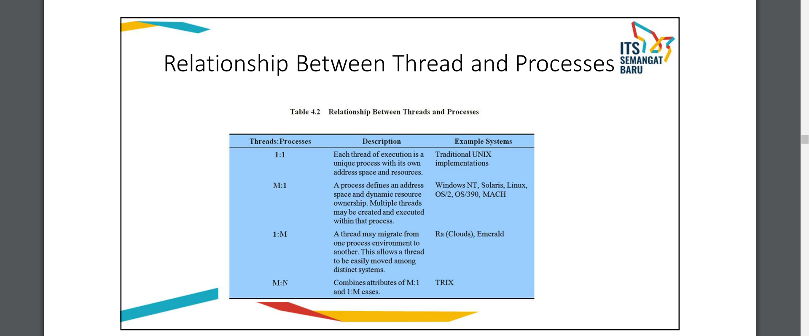

### Symmetric Multiprocessing (SMP).

- Traditionally the computer has been viewed as a sequential machine.
  - A processor executes instructions one at a time in sequence
  - Each instruction is a sequence of operations
- Two popular approaches to providing parallelism
  - Symmetric Multi Processors (SMPs)
  - Clusters (ch 16)

### Categories of Computer Systems

- Single Instruction Single Data (SISD) stream
  - Single processor executes a single instruction stream to operate on data
    stored in a single memory
- Single Instruction Multiple Data (SIMD) stream
  - Each instruction is executed on a different set of data by the different processors
- Multiple Instruction Single Data (MISD) stream
  - A sequence of data is transmitted to a set of processors, each of
    execute a different instruction sequence
- Multiple Instruction Multiple Data (MIMD)
  - A set of processors simultaneously execute different instruction sequences on different data sets

### Parallel Processor Architecture

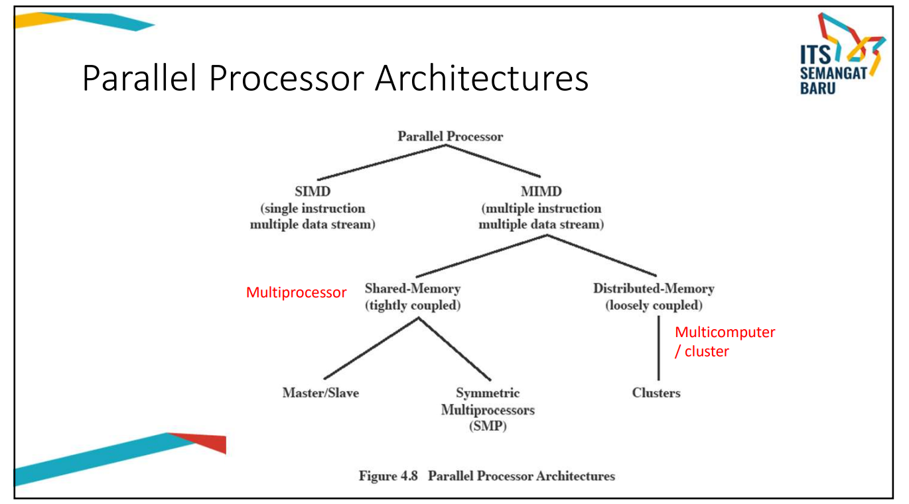

### Symmetric Multiprocessing

- Kernel can execute on any processor
  - Allowing portions of the kernel to execute in parallel
- Typically, each processor does self-scheduling from the pool of available process or threads

### Typical SMP Organization

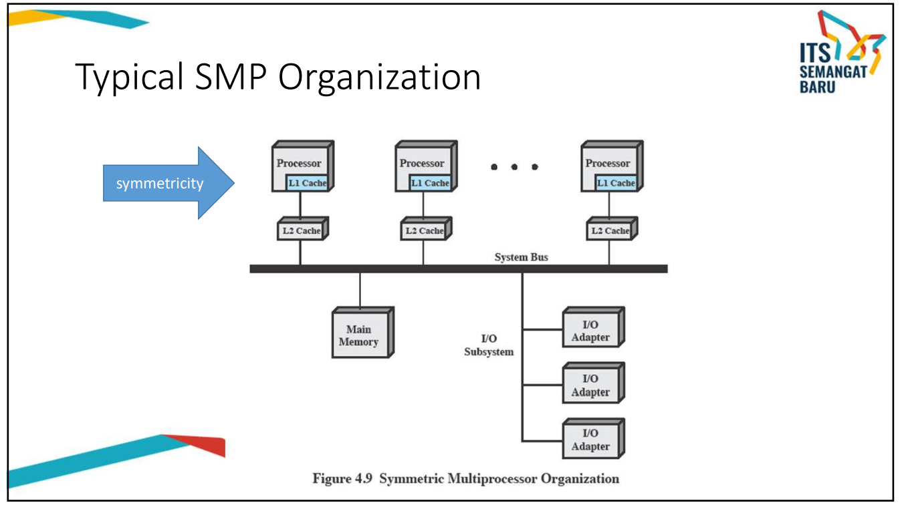

### Multiprocessor OS Design Considerations

- The key design issues include
  - Simultaneous concurrent processes or threads
  - Scheduling
  - Synchronization
  - Memory Management - Reliability and Fault Tolerance

### Microkernel

- A microkernel is a small OS core that provides the foundation for
  modular extensions.
- Big question is how small must a kernel be to qualify as a microkernel
  - Must drivers be in user space?
- In theory, this approach provides a high degree of flexibility and
  modularity.

### Kernel Architecture

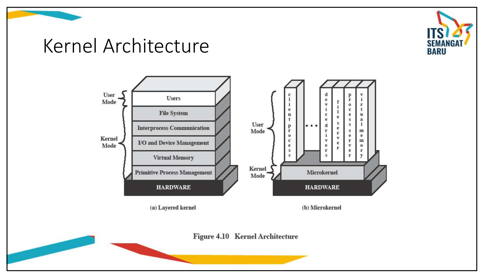

### Microkernel Design: Memory Management

- Low-level memory management - Mapping each virtual page to a
  physical page frame
  - Most memory management tasks occur in user space

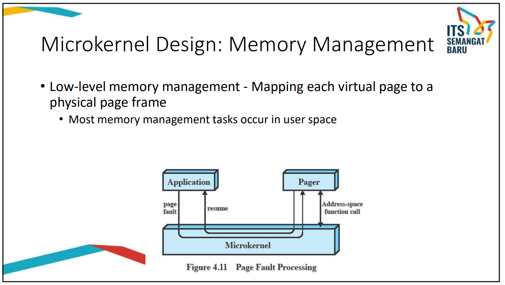

### Microkernel Design: Interprocess Communication

- Communication between processes or threads in a microkernel OS is
  via messages.
- A message includes:
  - A header that identifies the sending and receiving process and
  - A body that contains direct data, a pointer to a block of data, or some control information about the process.

### Microkernal Design: I/O and interrupt management

- Within a microkernel, it is possible to handle hardware interrupts as
  messages and to include I/O ports in address spaces.
  - a particular user-level process is assigned to the interrupt and the kernel maintains the mapping.

### Benefits of a Microkernel Organization

- Uniform interfaces on requests made by a process.
  - Extensibility
  - Flexibility
  - Portability
  - Reliability
  - Distributed System Support
  - Object Oriented Operating Systems

### Comparison Microkernel vs Monolithic kernel

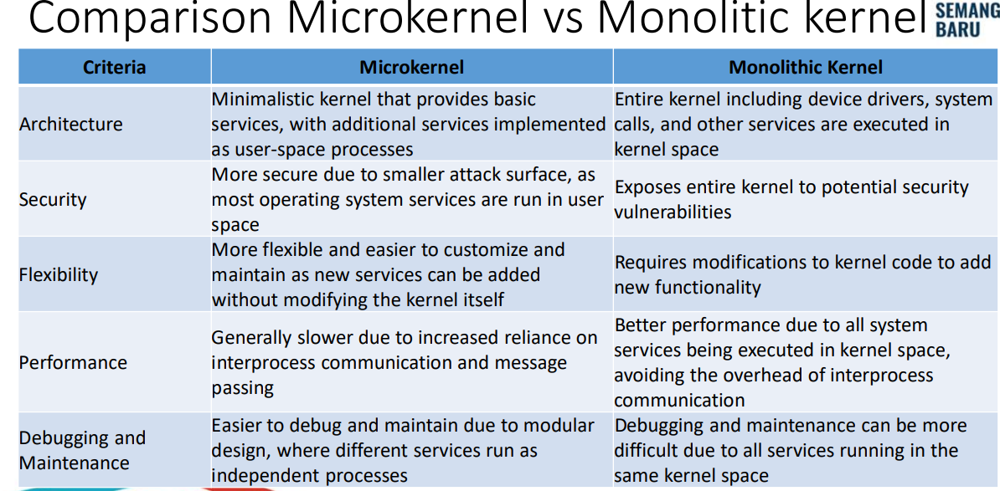

### Which OS uses microkernel / monolithic kernel

- Windows:
  - Windows NT and later versions use a hybrid kernel that combines elements of a microkernel and a monolithic kernel.
  - Earlier versions of Windows (such as Windows 95, 98, and ME) use a monolithic kernel.
- Linux:
  - a monolithic kernel, but it can also support loadable kernel modules that can be dynamically loaded and unloaded at runtime.
- macOS:
  - a hybrid kernel that combines elements of a microkernel and a monolithic kernel.
- iOS:
  - a hybrid kernel that combines elements of a microkernel and a monolithic kernel.
- Android:
  - a monolithic kernel, but it also includes a user-level component called the Binder IPC mechanism that provides some microkernel-like functionality.

## Interprocess Communication

### Multiple Processes

- Central to the design of modern Operating Systems is managing
  multiple processes
- Multiprogramming
- Multiprocessing
- Distributed Processing
- Big Issue is Concurrency - Managing the interaction of all of these processes

### Concurrency

Concurrency arises in:

- Multiple applications
  - Sharing time
- Structured applications
  - Extension of modular design
- Operating system structure
  - OS themselves implemented as a set of processes or threads

### Key terms related to concurrency

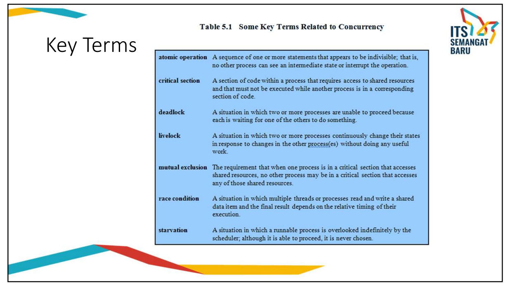

### Interleaving and Overlapping Processes

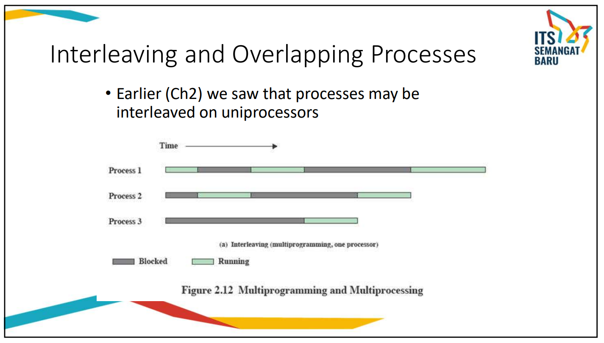
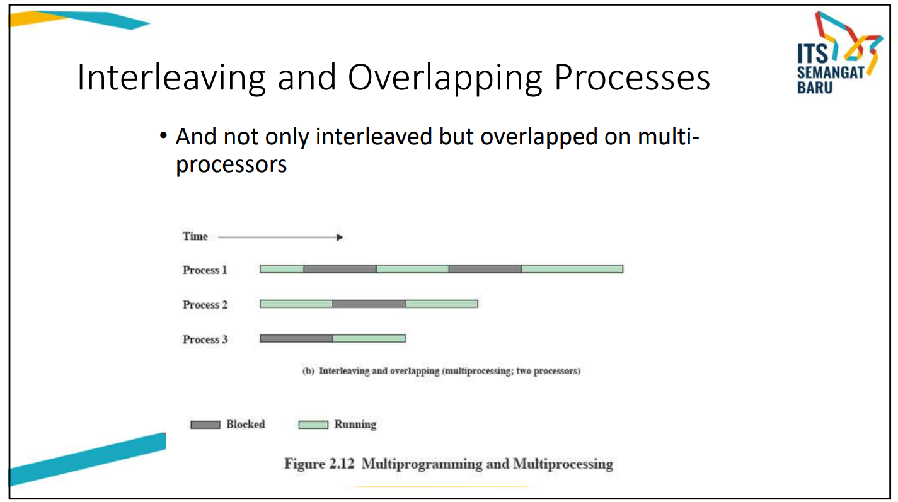

### Difficulties of Concurrency

- Sharing of global resources
- Optimally managing the allocation of resources
- Difficult to locate programming errors as results are not deterministic
  and reproducible.

### Race Condition

- A race condition occurs when
  - Multiple processes or threads read and write data items
  - They do so in a way where the final result depends on the order of execution of the processes.
  - The output depends on who finishes the race last.

### Operating System Concerns

- What design and management issues are raised by the existence of
  concurrency?
- The OS must
  - Keep track of various processes
  - Allocate and de-allocate resources
  - Protect the data and resources against interference by other processes.
  - Ensure that the processes and outputs are independent of the processing speed

### Process Interaction

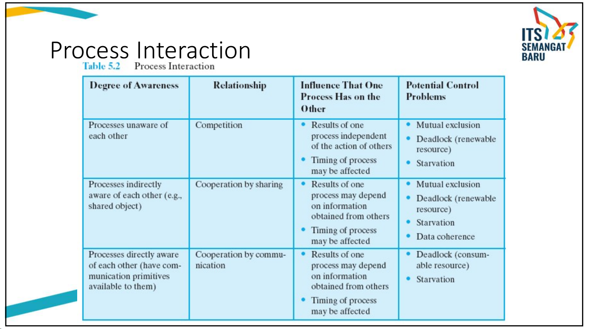

### Competition among Processes for Resources

Three main control problems:

- Need for Mutual Exclusion
  - Critical sections
- Deadlock
- Starvation

### Requirement for Mutual Exclusion

- Only one process at a time is allowed in the critical section for a
  resource
- A process that halts in its noncritical section must do so without
  interfering with other processes
- No deadlock or starvation
- A process must not be delayed access to a critical section when there
  is no other process using it
- No assumptions are made about relative process speeds or number
  of processes
- A process remains inside its critical section for a finite time only

## Mutual Exclusion: Hardware Support

### Disabling Interrupts

- Uniprocessors only allow interleaving
- Interrupt Disabling
- A process runs until it invokes an operating system service or until it is
  interrupted
- Disabling interrupts guarantees mutual exclusion
- Will not work in multiprocessor architecture

### Special Machine Instruction

- Compare&Swap Instruction - also called a “compare and exchange instruction”
- Exchange Instruction

### Pseudo-code

```c
while (true) {
/* disable interrupts */;
/* critical section */;
/* enable interrupts */;
/* remainder */;
}
```

```c
int compare_and_swap (int *word,
int testval, int newval)
{
int oldval;
oldval = *word;
if (oldval == testval) *word = newval;
return oldval;
}
```

### Mutual Exclusion

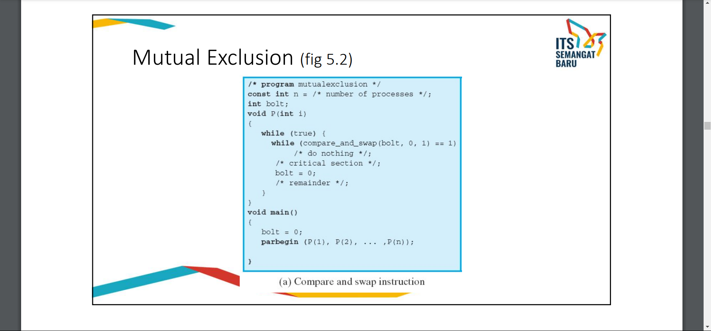

### Exchange Instruction

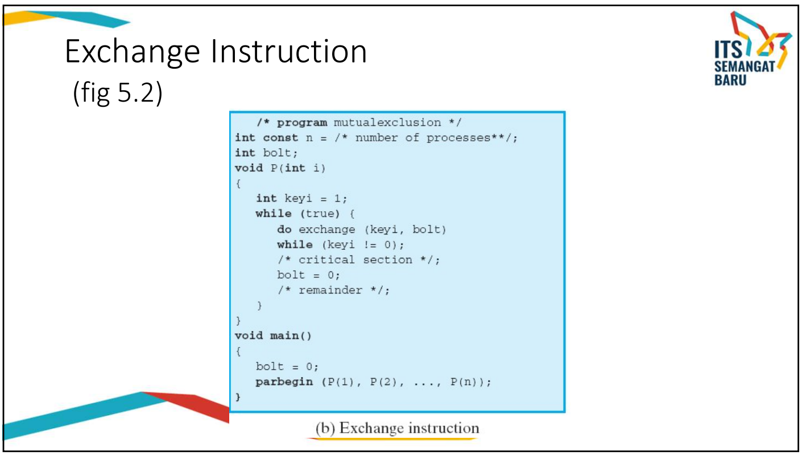

```c
void exchange (int register, int memory){
int temp;
temp = memory;
memory = register;
register = temp;
}
```

## Semaphore

- Semaphore: - An integer value used for signalling among processes. - Only three operations may be performed on a semaphore, all of
  which are atomic:
  - initialize,
  - Decrement (semWait)
  - increment. (semSignal)

### Semaphore Primitives

```c
struct semaphore{
    int count;
    queueType queue;
};

void semWait(semaphore s){
    s.count--;
    if (s.count < 0) {
        /*
        place this process in s.queue
        block this process
        */
    }
}

void semSignal(semaphore s){
    s.count++;
    if (s.count <= 0){
        /*
        remove a process P from s.queue
        place process P on ready list*/
    }
}
```

### Binary Semaphore Primitves

```c
struct binary_semaphore{
    enum {zero, one} value;
    queueType queue;
};

void semWait(binary_semaphore s){
    if (s.value == one)
    s.value = zero;
    else {
        /*
        place this process in s.queue
        block this process
        */
    }
}

void semSignalB(semaphore s){
    if (s.queue is empty())
        s.value = one;
    else{
        /*
        remove a process P from s.queue
        place process P on ready list
        */
    }
}
```

### Strong/Weak Semaphore

- A queue is used to hold processes waiting on the semaphore
  - In what order are processes removed from the queue?
- Strong Semaphores use FIFO
- Weak Semaphores don’t specify the order of removal from the
  queue

### Example of Strong Semaphore Mechanism

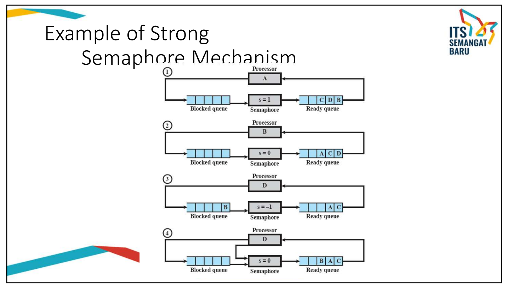

### Example of Semaphore Mechanism

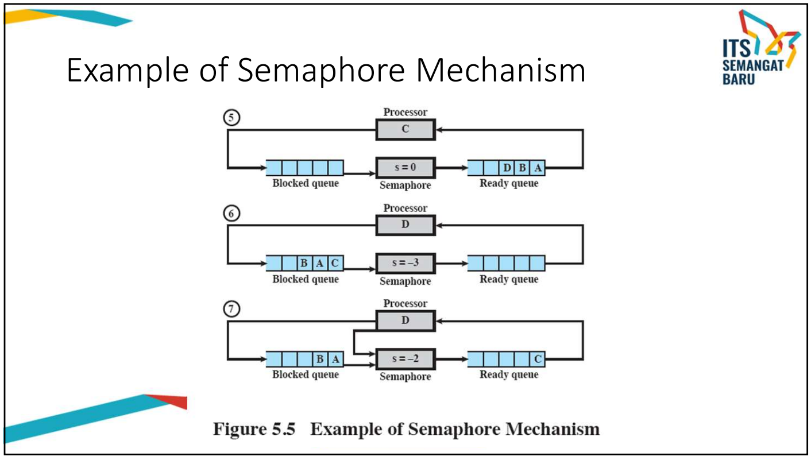

### Mutual Exclusion Using Semaphores

```c
// program mutualexclusion

const int n = /* number of processes */
semaphore s = 1
void P (int i){
    while(true){
        semWait(s);
        /* critical section */
        semSignal(s);
        /* remainder */
    }
}

void main(){
    parbegin(P(1), P(2), ..., P(n));
}
```
### Processes using semaphore
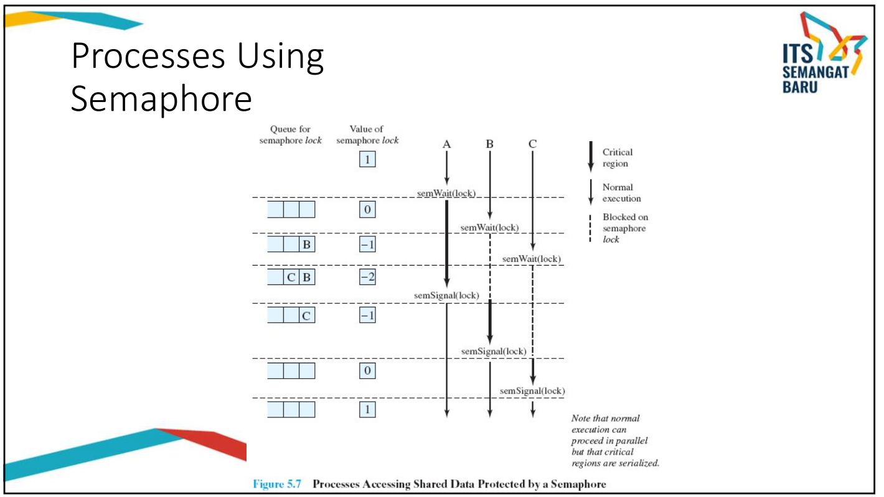